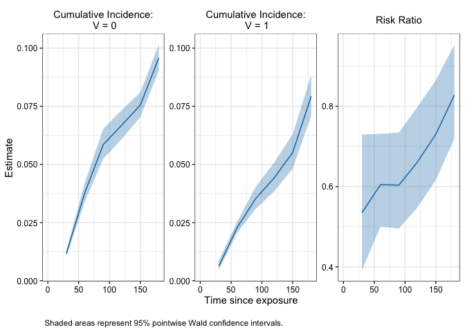

<!-- README.md is generated from README.Rmd. Please edit that file -->

# R/`nomatch`

> A matching alternative for more efficiently evaluating effectiveness
> of interventions using observational data

## Description

The `nomatch` package uses a G-computation style estimator to compute
effectiveness of binary interventions from observational cohort studies
following the target trial emulation framework. The proposed estimator
tends to produce similar point estimates as matching-based estimators
but can be more efficient.

## Installation

You can install the development version of `nomatch` with:

``` r
# install.packages("devtools")
devtools::install_github("ewu16/nomatch")
```

## Example

This minimal example shows how to use `nomatch` to obtain cumulative
incidences and their derived effect measures such as risk differences
(RD), risk ratios (RR), and vaccine effectiveness (VE = 1 - RR).

We use a simple simulated dataset mimicking data from an observational
vaccine study, although the methods apply equally to other disease
settings.

``` r

#Load package
library(nomatch)

# Example data
simdata <- as_tibble(simdata) #for prettier printing 

#View data
head(simdata)
#> # A tibble: 6 × 7
#>      ID    x1    x2     V D_obs     Y event
#>   <int> <int> <int> <int> <dbl> <dbl> <dbl>
#> 1     1     1     7     1     2    92     0
#> 2     2     0     7     0    NA   210     0
#> 3     3     0    11     1    35   210     0
#> 4     4     0    10     1     6   210     0
#> 5     5     1    11     0    NA   210     0
#> 6     6     1     7     0    NA    90     0
```

Note that the dataset contains the following:

- one row per individual (`ID`)

- a set of baseline covariates (`x1`, `x2`)

- exposure status (`V`) with values `1 = vaccinated, 0 = unvaccinated`.
  (Note: its currently assumed that the unexposed group does not receive
  an active comparator)

- time to vaccination (`D_obs`); for unvaccinated individuals this is
  left as `NA`.

- right censored survival data `(Y, event)`

  - `Y` represents follow-up time for an outcome such as infection,
    hospitalization or death (`Y`)
  - `event` indicates whether individual experienced the event or
    censoring with values `1 = event, 0 = censored`

``` r

# Compute cumulative incidence and effect measures 
fit <- nomatch(data = simdata,
                  outcome_time = "Y",
                  outcome_status = "event",
                  exposure = "V",
                  exposure_time = "D_obs", 
                  covariates = c("x1", "x2"),
                  immune_lag = 14,
                  eval_times = seq(30, 180, by = 30),
                  effect = "vaccine_effectiveness", 
                  boot_reps = 10)
#> Bootstrapping 10 samples...
#> Time difference of 1.533158 secs

# Print main results 
## - Note by default only the chosen effect measure is printed
## but all effect measures are computed and stored in the fitted object 
fit        
#> 
#>  Vaccine Effectiveness Estimates 
#> ================================================== 
#> Call: nomatch(data = simdata, outcome_time = "Y", outcome_status = "event", 
#>     exposure = "V", exposure_time = "D_obs", covariates = c("x1", 
#>         "x2"), immune_lag = 14, eval_times = seq(30, 180, by = 30), 
#>     effect = "vaccine_effectiveness", boot_reps = 10) 
#> 
#> Result:
#>   Timepoint Estimate 95% Wald CI: Lower 95% Wald CI: Upper Wald p-value
#> 1        30    0.466             0.0902              0.686     0.086340
#> 2        60    0.395             0.2359              0.521     0.000925
#> 3        90    0.397             0.2594              0.508     0.000148
#> 4       120    0.339             0.2011              0.453     0.000448
#> 5       150    0.269             0.1387              0.380     0.001338
#> 6       180    0.172             0.0444              0.283     0.018627
#> 
#> Use summary() for more details
#> Use plot() to visualize results

# View additional details about the analytic approach 
summary(fit)
#> 
#> ====================================================================== 
#> Vaccine Effectiveness Analysis Summary
#> ====================================================================== 
#> 
#> Method:              nomatch (G-computation) 
#> Evaluation times:    30, 60, 90, 120, 150, 180  
#> Immune lag:          14 
#> Adjusted for:        x1, x2 
#> 
#> Bootstrap:           10 replicates
#> Confidence level:    95 %
#> Successful samples:  10-10  (range across timepoints)
#> 
#> ---------------------------------------------------------------------- 
#> Sample:
#> ---------------------------------------------------------------------- 
#> N total: 10000 
#> Number of events: 1007 
#> 
#> N exposed: 4112 
#> N exposed at-risk <immune_lag> days after exposure: 4045 
#> 
#> Distribution of exposure times among at-risk <immune_lag> days after exposure:
#>  Range:  1 - 194 |  Median (IQR):  18 (11 - 32) |  Mean:  25.5
#> 
#> ---------------------------------------------------------------------- 
#> Model for unexposed:
#> ---------------------------------------------------------------------- 
#> N = 10000 | Number of events = 664 
#> 
#> Use '$model_0' to see model details.
#> 
#> ---------------------------------------------------------------------- 
#> Model for exposed:
#> ---------------------------------------------------------------------- 
#> N = 4045 | Number of events = 265 
#> 
#> Use '$model_1' to see model details.
#> 
#> ======================================================================

# Plot cumulative incidence and effect measures over time 
plot(fit) 
```



## Issues

If you encounter any bugs or have any specific feature requests, please
[file an issue](https://github.com/ewu16/nomatch/issues).

## Citation

If you use the `nomatch` package in your work, please cite the
following:

     @Manual{,
       title = {nomatch: Estimate Effectiveness of Interventions in Target Trial Emulation Observational Studies
                 Without Matching},
       author = {Emily Wu},
       year = {2025},
       note = {R package version 0.0.0.9000, 
       https://github.com/ewu16/nomatch},
       url = {https://ewu16.github.io/nomatch/},
     }
