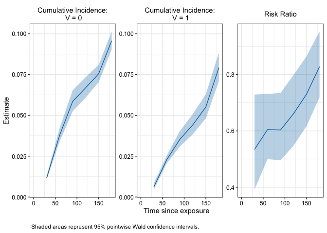

<!-- README.md is generated from README.Rmd. Please edit that file -->

# R/`nomatch`

> A matching alternative for more efficiently evaluating effectiveness
> of interventions using observational data

------------------------------------------------------------------------

## Description

The `nomatch` package uses a G-computation style estimator to compute
the effectiveness of a binary intervention in observational cohort
studies that use the target trial emulation approach. The proposed
estimator tends to produce similar point estimates as matching-based
estimators but can be more efficient.

------------------------------------------------------------------------

## Installation

You can install the development version of `nomatch` with:

``` r
# install.packages("devtools")
devtools::install_github("ewu16/nomatch")
```

------------------------------------------------------------------------

## Example

This minimal example shows how to use `nomatch` to obtain cumulative
incidences and their derived effect measures such as risk differences
(RD), risk ratios (RR), and relative risk reductions (1 - RR).

We use a simple simulated dataset based on an observational vaccine
study, although data from other disease settings can be used.

``` r

# Load package
library(nomatch)

# View example data
simdata <- as_tibble(simdata) #for prettier printing 
head(simdata)
#> # A tibble: 6 × 7
#>      ID    x1    x2     V D_obs     Y event
#>   <int> <int> <int> <int> <dbl> <dbl> <dbl>
#> 1     1     1     7     1     2    92     0
#> 2     2     0     7     0    NA   210     0
#> 3     3     0    11     1    35   210     0
#> 4     4     0    10     1     6   210     0
#> 5     5     1    11     0    NA   210     0
#> 6     6     1     7     0    NA    90     0
```

The dataset contains the following:

- one row per individual (`ID`)
- a set of baseline covariates (`x1`, `x2`)
- exposure status (`V`) with values `1 = vaccinated, 0 = unvaccinated`.
- time to vaccination (`D_obs`); for unvaccinated individuals this is
  left as `NA`.
- right censored survival data `(Y, event)`
  - `Y` represents follow-up time for an outcome such as infection,
    hospitalization or death.
  - `event` indicates whether individual experienced the event or
    censoring with values `1 = event, 0 = censored`.

``` r

# Use nomatch to compute cumulative incidence and effect estimates 
fit <- nomatch(data = simdata,
               outcome_time = "Y",
               outcome_status = "event",
               exposure = "V",
               exposure_time = "D_obs", 
               covariates = c("x1", "x2"),
               immune_lag = 14,
               timepoints = seq(30, 180, by = 30),
               boot_reps = 10)

# Examine object produced by nomatch - shows risk ratio estimates by default 
fit        
#> 
#>  Risk Ratio Estimates 
#> ================================================== 
#> Call: nomatch(data = simdata, outcome_time = "Y", outcome_status = "event", 
#>     exposure = "V", exposure_time = "D_obs", covariates = c("x1", 
#>         "x2"), immune_lag = 14, timepoints = seq(30, 180, by = 30), 
#>     boot_reps = 10) 
#> 
#> Result:
#>   Timepoint Estimate 95% Wald CI: Lower 95% Wald CI: Upper Wald p-value
#> 1        30    0.534              0.392              0.729     3.30e-03
#> 2        60    0.605              0.500              0.731     4.49e-05
#> 3        90    0.603              0.496              0.735     7.66e-05
#> 4       120    0.661              0.548              0.798     4.24e-04
#> 5       150    0.731              0.617              0.865     1.77e-03
#> 6       180    0.828              0.719              0.953     1.65e-02
#> 
#> Use summary() for more details
#> Use plot() to visualize results

# Plot cumulative incidence and effect estimates
plot(fit) 
```



------------------------------------------------------------------------

## Issues

If you encounter any bugs or have any specific feature requests, please
[file an issue](https://github.com/ewu16/nomatch/issues).

------------------------------------------------------------------------

## Citation

If you use the `nomatch` package in your work, please cite the
following:

     @Manual{,
       title = {nomatch: Estimate Effectiveness of Interventions in Target Trial Emulation Observational Studies
                 Without Using Matching},
       author = {Emily Wu},
       year = {2026},
       https://github.com/ewu16/nomatch},
       url = {https://ewu16.github.io/nomatch/},
     }
