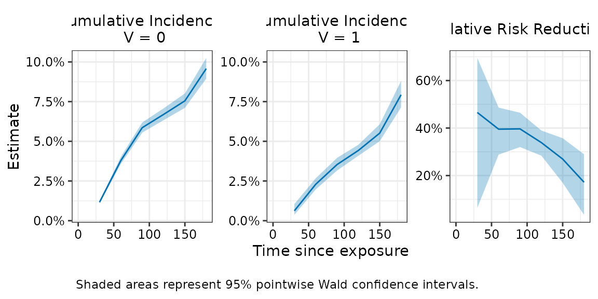
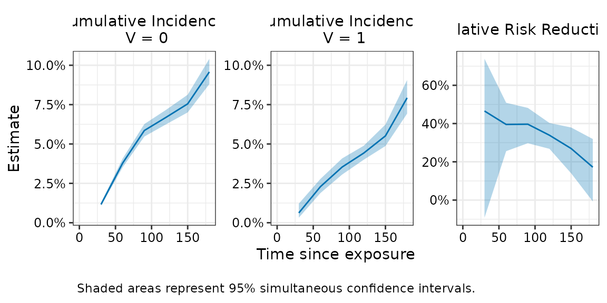
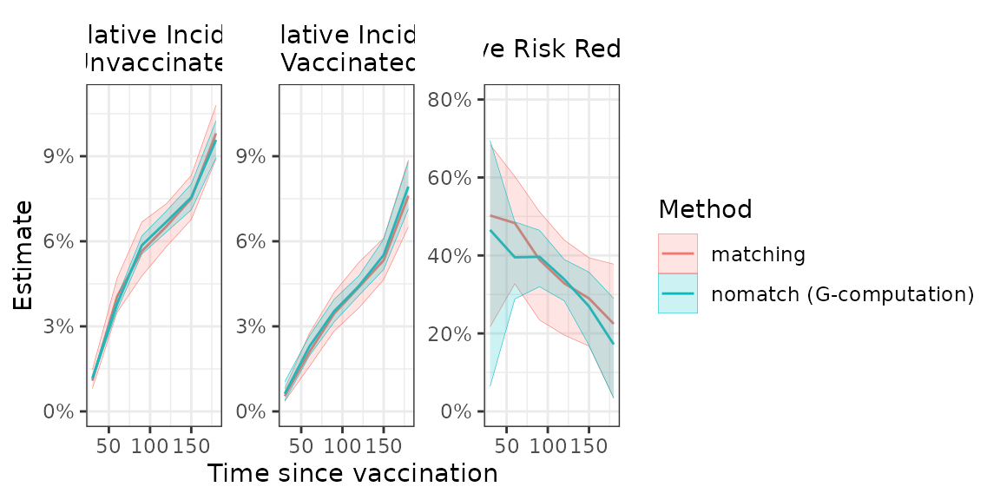

# nomatch

## Introduction

The `nomatch` package uses G-computation style estimation to compute
marginal cumulative incidence in observational cohort studies with a
binary exposure and a time-to-event outcome. The approach aligns with
the target trial emulation framework (Hernán and Robins 2016) and
provides an alternative to matching-based methods, which can be
inefficient. Estimation involves fitting two exposure-specific Cox
models which adjust for baseline confounders. Predictions from these
models are used to estimate marginal cumulative incidence under
interventions of exposure and no exposure. Effect measures such as risk
differences, risk ratios, and relative risk reduction are also provided.

------------------------------------------------------------------------

## Method

To study the effectiveness of an intervention, we would ideally conduct
a randomized trial. In such a trial, individuals are assigned to receive
the intervention or not at a well-defined time, and outcomes are
measured from the time of assignment. Cumulative incidence between the
two groups can then be compared at a fixed follow-up time.

In observational studies, this comparison is less straightforward
because individuals who remain unexposed do not have an obvious start of
follow-up. One way to address this issue is to imagine assigning
individuals to receive (or not receive) the intervention on specific
days, similar to the assignment time in a randomized trial.

Under this perspective, we can define cumulative incidences for each
intervention day and covariate group. These quantities can then be
averaged (marginalized) over the observed distribution of exposure days
and covariates to obtain overall cumulative incidence estimates. This
mirrors the marginal comparisons typically reported in randomized
trials, where cumulative incidence estimates implicitly average over the
distribution of assignment times and baseline covariates within each
treatment group.

------------------------------------------------------------------------

## Usage

We use `nomatch` to estimate the effectiveness of a binary exposure in
an observational cohort study. The package can be loaded as follows:

``` r
library(nomatch)
```

We illustrate the use of the package using a simple simulated dataset,
`simdata`, included in the package. For exposition, we will assume this
dataset represents data from an observational vaccine study. In
practice, data from other disease settings can be used as well. The
first few rows of `simdata` can be viewed as follows:

``` r
simdata <- as_tibble(simdata) #for prettier printing

# View data
head(simdata)
#> # A tibble: 6 × 7
#>      ID    x1    x2     V D_obs     Y event
#>   <int> <int> <int> <int> <dbl> <dbl> <dbl>
#> 1     1     1     7     1     2    92     0
#> 2     2     0     7     0    NA   210     0
#> 3     3     0    11     1    35   210     0
#> 4     4     0    10     1     6   210     0
#> 5     5     1    11     0    NA   210     0
#> 6     6     1     7     0    NA    90     0
```

The data contains one row per individual (`ID`) and a set of individual
baseline covariates (`x1`, `x2`). Information on an individual’s
exposure is encompassed in 1) their binary vaccination status `V` with
values `1 = vaccinated, 0 = unvaccinated`, and 2) their time to
receiving vaccination `D_obs`, which is a numeric value for vaccinated
individuals and `NA` for unvaccinated individuals. The data also
includes a right-censored survival outcome`(Y, event)` where `Y`
represents follow-up time for an outcome (e.g. infection or death), and
`event` indicates whether the individual experienced the event with
values `1 = event, 0 = censored`.

------------------------------------------------------------------------

### Estimating cumulative incidence

We can invoke the `nomatch` function to compute marginal cumulative
incidences. The main types of arguments are:

- **Data
  arguments**`- data, outcome_time, outcome_status, exposure, exposure_time, covariates`:
  Specify the dataset and the variable names describing the outcome,
  exposure, and confounders.

- **Estimation arguments** control what cumulative incidences are
  computed:

  - `immune_lag` excludes events occuring with `immune_lag` time units
    after exposure. This is common in vaccine studies, where immunity
    takes time to develop. In this example we set `immune_lag = 14`
    days, although it can be set to 0 when not relevant.
  - `timepoints` when to evaluate cumulative incidence. Here we compute
    cumulative incidence at 30, 60, 90, …, 180 days after vaccination.

- **Bootstrap argument** - `boot_reps`controls how many bootstrap
  replicates are used to construct confidence intervals and p-values. We
  use a small number here for speed, but `boot_reps = 1000` is
  recommended for publication-quality results. By default, Wald-type
  bootstrap confidence intervals are returned. Bootstraps can be
  parallelized using the [`future`](https://future.futureverse.org)
  framework. Simply set a parallel plan before calling nomatch(): e.g.

``` r
# Set parallel plan before calling nomatch(): 
# - multisession is recommended as it runs multiple parallel processes 
#   in the background  and is supported by all operating systems
future::plan(future::multisession, workers = 4)
# Run nomatch() 
fit <- nomatch(..., boot_reps = 1000, seed = 123)
# Reset when done 
future::plan(future::sequential)  
```

Since we have specified a small number of bootstraps, we will run the
code without setting up a parallel backend.

``` r

# Compute cumulative incidence 
fit <- nomatch(data = simdata,
               outcome_time = "Y",
               outcome_status = "event",
               exposure = "V",
               exposure_time = "D_obs", 
               covariates = c("x1", "x2"),
               immune_lag = 14,
               timepoints = seq(30, 180, by = 30),
               boot_reps = 10)
#> Bootstrapping 10 samples...
#> Bootstrap completed in 3.78 secs
```

The cumulative incidence estimates (`cuminc_0` for unexposed and
`cuminc_1` for exposed) ) and other effectiveness measures are stored
within the `$estimates` component of the fitted object.

``` r
str(fit$estimates, give.attr = FALSE)
#> List of 5
#>  $ cuminc_0               : num [1:6, 1:5] 0.0116 0.0379 0.0586 0.0669 0.0755 ...
#>  $ cuminc_1               : num [1:6, 1:5] 0.00622 0.02293 0.03535 0.04424 0.05515 ...
#>  $ risk_difference        : num [1:6, 1:5] -0.00542 -0.01498 -0.02323 -0.02267 -0.02034 ...
#>  $ risk_ratio             : num [1:6, 1:5] 0.534 0.605 0.603 0.661 0.731 ...
#>  $ relative_risk_reduction: num [1:6, 1:5] 0.466 0.395 0.397 0.339 0.269 ...
```

We can thus preview the relative risk reduction estimates (i.e. vaccine
effectiveness) using

``` r
head(fit$estimates$relative_risk_reduction) 
#>      estimate wald_lower wald_upper    wald_pval wald_n
#> 30  0.4655914 0.06415232  0.6948301 2.838690e-02     10
#> 60  0.3952484 0.28840317  0.4860510 1.370845e-09     10
#> 90  0.3965357 0.31989227  0.4645419 2.220446e-16     10
#> 120 0.3388351 0.28382017  0.3896239 0.000000e+00     10
#> 150 0.2694672 0.16974131  0.3572146 1.515877e-06     10
#> 180 0.1719935 0.03465023  0.2897966 1.593802e-02     10
```

If all confounders are adjusted for, the resulting cumulative
incidence/effect estimates can be interpreted as the cumulative
incidences or effect that would be observed in a clinical trial in which
participants 1) are similar to those observed to be exposed and 2) who
enroll into the study such that the distribution of enrollments times
matches the distribution of observed exposure times.

### Additional details about estimation approach

Internally,
[`nomatch()`](https://ewu16.github.io/nomatch/reference/nomatch.md) fits
two Cox models — one for the unexposed, one for the exposed.

In the **unexposed model**, time to endpoint is measured from the study
start (or chosen time origin). This model includes all individuals, with
exposed individuals censored at their time of exposure. The model
adjusts fo baseline covariates.

In the **exposed model**, time to endpoint is measured from the time of
exposure. This model includes only exposed individuals who remained
event-free `immune_lag` days after exposure. The model adjusts for
baseline covariates and flexibly accounts for when exposure occurred (by
default, using a natural cubic spline with 4 degrees of freedom).

These Cox models are used to predict time- and covariate-specific
cumulative incidences which are then marginalized. By default, the
predictions are marginalized over the distribution of exposure times and
covariates in the exposed.

A summary of the estimation approach and fitted models can be obtained
by

``` r
summary(fit)
#> 
#> ====================================================================== 
#> Analysis Summary
#> ====================================================================== 
#> Method:              nomatch (G-computation) 
#> Evaluation times:    30, 60, 90, 120, 150, 180  
#> Immune lag:          14 
#> Adjusted for:        x1, x2 
#> 
#> Bootstrap:           10 replicates
#> Confidence level:    95 %
#> Successful samples:  10-10  (range across timepoints)
#> ---------------------------------------------------------------------- 
#> Sample:
#> ---------------------------------------------------------------------- 
#> N total: 10000 
#> Number of events: 1007 
#> 
#> N exposed: 4112 
#> N exposed at-risk <immune_lag> days after exposure: 4045 
#> 
#> Distribution of exposure times among at-risk <immune_lag> days after exposure:
#>  Range:  1 - 194 |  Median (IQR):  18 (11 - 32) |  Mean:  25.5
#> 
#> ---------------------------------------------------------------------- 
#> Model for unexposed:
#> ---------------------------------------------------------------------- 
#> N = 10000 | Number of events = 664 
#> Use '$model_0' to see model details.
#> 
#> ---------------------------------------------------------------------- 
#> Model for exposed:
#> ---------------------------------------------------------------------- 
#> N = 4045 | Number of events = 265 
#> Use '$model_1' to see model details.
#> 
#> ======================================================================
```

and the weights used for marginalization are returned in the `$weights`
component of the fitted object.

### Plotting cumulative incidence curves

We can visualize the cumulative incidence and effectiveness estimates
using [`plot()`](https://rdrr.io/r/graphics/plot.default.html). If
smooth cumulative incidence curves are desired, it is best to supply a
dense grid of timepoints. Our example plot appears somewhat coarse
because we evaluated the estimates at only six timepoints.

``` r
plot(fit, effect = "relative_risk_reduction")
```



#### Plotting simultaneous confidence intervals

The plot above shows pointwise confidence intervals, which are the usual
95% CIs computed independently at each timepoint. If inference on the
entire curve is desired, simultaneous confidence intervals should be
used instead. These can be added using
[`add_simultaneous_ci()`](https://ewu16.github.io/nomatch/reference/add_simultaneous_ci.md).
This function updates an existing fit with simultaneous confidence
intervals, provided bootstrap samples were retained (keep_boot_samples =
TRUE, the default). The updated fit should be saved as a new object.

``` r
#Compute simultaneous CI
fit_with_simul <- add_simultaneous_ci(fit, seed = 1234)
```

The simultaneous confidence intervals are now stored in the fitted
object.

``` r
fit_with_simul
#> 
#>  Risk Ratio Estimates 
#> ================================================== 
#> Call: nomatch(data = simdata, outcome_time = "Y", outcome_status = "event", 
#>     exposure = "V", exposure_time = "D_obs", covariates = c("x1", 
#>         "x2"), immune_lag = 14, timepoints = seq(30, 180, by = 30), 
#>     boot_reps = 10) 
#> 
#> Result:
#>   Timepoint Estimate 95% Wald CI: Lower 95% Wald CI: Upper Wald p-value
#> 1        30    0.534              0.305              0.936     2.84e-02
#> 2        60    0.605              0.514              0.712     1.37e-09
#> 3        90    0.603              0.535              0.680     2.22e-16
#> 4       120    0.661              0.610              0.716     0.00e+00
#> 5       150    0.731              0.643              0.830     1.52e-06
#> 6       180    0.828              0.710              0.965     1.59e-02
#>   95% Simul CI: Lower 95% Simul CI: Upper
#> 1               0.261               1.093
#> 2               0.491               0.744
#> 3               0.518               0.703
#> 4               0.597               0.732
#> 5               0.620               0.860
#> 6               0.681               1.007
#> 
#> Use summary() for more details
#> Use plot() to visualize results
```

To plot simultaneous confidence intervals, use
[`plot()`](https://rdrr.io/r/graphics/plot.default.html) with the
argument `ci_type = "simul"`.  
The fitted object must already contain the simultaneous confidence
intervals; otherwise, the call will return an error.

``` r
#Plot simultaneous confidence bands 
plot(fit_with_simul , effect = "relative_risk_reduction", ci_type = "simul") 
```



The simultaneous confidence intervals indicate that 95% of such bands,
constructed across repeated samples, would contain the entire true
curve.

### Creating custom plots

Users may also wish to create their own plots. The function
[`estimates_to_df()`](https://ewu16.github.io/nomatch/reference/estimates_to_df.md)
takes the estimates component of the fitted object and reformats it into
a long dataset suitable for plotting.

``` r
plot_data <- estimates_to_df(fit)

head(as_tibble(plot_data))
#> # A tibble: 6 × 7
#>      t0 term                    estimate wald_lower wald_upper wald_pval wald_n
#>   <dbl> <chr>                      <dbl>      <dbl>      <dbl>     <dbl>  <dbl>
#> 1    30 cuminc_0                 0.0116     0.0109     0.0125   NA           10
#> 2    30 cuminc_1                 0.00622    0.00369    0.0105   NA           10
#> 3    30 risk_difference         -0.00542   -0.00904   -0.00180   0.00336     10
#> 4    30 risk_ratio               0.534      0.305      0.936     0.0284      10
#> 5    30 relative_risk_reduction  0.466      0.0642     0.695     0.0284      10
#> 6    60 cuminc_0                 0.0379     0.0357     0.0402   NA           10
```

For example, we can create a plot that overlays the cumulative incidence
estimates for the two exposure types as follows:

``` r
plot_data |> 
  filter(term %in% c("cuminc_0", "cuminc_1")) |> 
  ggplot(aes(x = t0, y = estimate, color = term, fill = term)) + 
  geom_line() + 
  geom_ribbon(aes(ymin = wald_lower, ymax = wald_upper), alpha = 0.2, linewidth = 0) + 
  theme_bw() +
  scale_color_discrete(breaks = c("cuminc_0", "cuminc_1"), labels = c("Unvaccinated", "Vaccinated"))+
  scale_fill_discrete(breaks = c("cuminc_0", "cuminc_1"), labels = c("Unvaccinated", "Vaccinated"))+ 
  labs(x = "Time since vaccination",
       y = "Estimate",
       title = "Cumulative Incidence Curves", 
       color = "Exposure Group",
       fill = "Exposure Group")
```



### Comparison with matching

Our estimation approach is generally expected to produce similar point
estimates as a rolling-cohort matching analysis in which exposed
individuals are matched to unexposed individuals at their time of
exposure. However, our approach may offer greater precision, which can
be particularly beneficial in smaller samples or when endpoints are
rare.

For comparison, we provide a simple implementation of a rolling-cohort
matching analysis using 1:1 exact matching and Kaplan–Meier estimation
to compute marginal cumulative incidences. These matching functions are
intentionally limited in scope and may be slow on large datasets.

``` r
# ------------------------------------------------------------------------------
# 3. Compare results with matching estimator

matched_cohort <- match_rolling_cohort(data = simdata,
                                       outcome_time = "Y",
                                       exposure = "V",
                                       exposure_time = "D_obs", 
                                       matching_vars = c("x1", "x2"),
                                       id_name = "ID",
                                       seed = 5678)

matched_data <- matched_cohort[[1]]


fit_matching <-matching(matched_data = matched_data,
                        outcome_time = "Y",
                        outcome_status = "event",
                        exposure = "V",
                        exposure_time = "D_obs", 
                        immune_lag = 14,
                        timepoints = seq(30, 180, by = 30),
                        boot_reps = 10) 
#> Bootstrapping 10 samples...
#> Bootstrap completed in 1.56 secs

fit_matching
#> 
#>  Risk Ratio Estimates 
#> ================================================== 
#> Call: matching(matched_data = matched_data, outcome_time = "Y", outcome_status = "event", 
#>     exposure = "V", exposure_time = "D_obs", immune_lag = 14, 
#>     timepoints = seq(30, 180, by = 30), boot_reps = 10) 
#> 
#> Result:
#>   Timepoint Estimate 95% Wald CI: Lower 95% Wald CI: Upper Wald p-value
#> 1        30    0.497              0.316              0.783     2.55e-03
#> 2        60    0.517              0.397              0.672     8.81e-07
#> 3        90    0.611              0.488              0.766     1.81e-05
#> 4       120    0.671              0.561              0.804     1.53e-05
#> 5       150    0.710              0.606              0.832     2.36e-05
#> 6       180    0.775              0.622              0.966     2.35e-02
#> 
#> Use summary() for more details
#> Use plot() to visualize results

# Plot matching vs proposed estimator - nomatch tends to have similar point estimates but narrower
# confidence intervals

comparison  <- rbind(estimates_to_df(fit) |> mutate(method = "nomatch (G-computation)"),
                       estimates_to_df(fit_matching)  |> mutate(method = "matching"))

comparison |> 
  filter(term %in% c("cuminc_0", "cuminc_1", "relative_risk_reduction")) |> 
  mutate(term_label = factor(term, 
                             c("cuminc_0", "cuminc_1", "relative_risk_reduction"),
                             c("Cumulative Incidence:\n Unvaccinated",
                               "Cumulative Incidence:\n Vaccinated",
                               "Relative Risk Reduction"))) |> 
  ggplot(aes(x = t0, y = estimate, color = method, fill = method)) + 
  geom_line() +
  geom_ribbon(aes(ymin = wald_lower, ymax = wald_upper), alpha = 0.2, linewidth = 0.1) + 
  facet_wrap(~term_label, scales = "free") + 
  ggh4x::facetted_pos_scales(
    y = list(
      ggplot2::scale_y_continuous(labels = scales::label_percent(),
                                  limits = c(0, 0.11)),
      ggplot2::scale_y_continuous(labels = scales::label_percent(),
                                  limits = c(0, 0.11)),
      ggplot2::scale_y_continuous(labels = scales::label_percent(),
                                  limits = c(0, 0.8))
    )) + 
  theme_bw() +
  theme(strip.background = ggplot2::element_rect(fill = "white", color = "white"),
         strip.text = ggplot2::element_text(size = 11, colour = "black")) + 
  labs(x = "Time since vaccination", 
       y = "Estimate", 
       color = "Method",
       fill = "Method")
```


## Session Information

    #> R version 4.5.3 (2026-03-11)
    #> Platform: x86_64-pc-linux-gnu
    #> Running under: Ubuntu 24.04.3 LTS
    #> 
    #> Matrix products: default
    #> BLAS:   /usr/lib/x86_64-linux-gnu/openblas-pthread/libblas.so.3 
    #> LAPACK: /usr/lib/x86_64-linux-gnu/openblas-pthread/libopenblasp-r0.3.26.so;  LAPACK version 3.12.0
    #> 
    #> locale:
    #>  [1] LC_CTYPE=C.UTF-8       LC_NUMERIC=C           LC_TIME=C.UTF-8       
    #>  [4] LC_COLLATE=C.UTF-8     LC_MONETARY=C.UTF-8    LC_MESSAGES=C.UTF-8   
    #>  [7] LC_PAPER=C.UTF-8       LC_NAME=C              LC_ADDRESS=C          
    #> [10] LC_TELEPHONE=C         LC_MEASUREMENT=C.UTF-8 LC_IDENTIFICATION=C   
    #> 
    #> time zone: UTC
    #> tzcode source: system (glibc)
    #> 
    #> attached base packages:
    #> [1] stats     graphics  grDevices utils     datasets  methods   base     
    #> 
    #> other attached packages:
    #> [1] purrr_1.2.1   future_1.70.0 nomatch_0.1.0 dplyr_1.2.0   ggplot2_4.0.2
    #> [6] tibble_3.3.1 
    #> 
    #> loaded via a namespace (and not attached):
    #>  [1] utf8_1.2.6         sass_0.4.10        generics_0.1.4     lattice_0.22-9    
    #>  [5] listenv_0.10.1     digest_0.6.39      magrittr_2.0.4     evaluate_1.0.5    
    #>  [9] grid_4.5.3         RColorBrewer_1.1-3 fastmap_1.2.0      jsonlite_2.0.0    
    #> [13] Matrix_1.7-4       survival_3.8-6     scales_1.4.0       codetools_0.2-20  
    #> [17] textshaping_1.0.5  jquerylib_0.1.4    cli_3.6.5          rlang_1.1.7       
    #> [21] parallelly_1.46.1  splines_4.5.3      withr_3.0.2        cachem_1.1.0      
    #> [25] yaml_2.3.12        ggh4x_0.3.1        tools_4.5.3        parallel_4.5.3    
    #> [29] globals_0.19.1     vctrs_0.7.1        R6_2.6.1           lifecycle_1.0.5   
    #> [33] fs_1.6.7           MASS_7.3-65        ragg_1.5.1         furrr_0.3.1       
    #> [37] pkgconfig_2.0.3    desc_1.4.3         pkgdown_2.2.0      pillar_1.11.1     
    #> [41] bslib_0.10.0       gtable_0.3.6       glue_1.8.0         systemfonts_1.3.2 
    #> [45] xfun_0.56          tidyselect_1.2.1   knitr_1.51         farver_2.1.2      
    #> [49] htmltools_0.5.9    rmarkdown_2.30     labeling_0.4.3     compiler_4.5.3    
    #> [53] S7_0.2.1

Hernán, Miguel A., and James M. Robins. 2016. “Using Big Data to Emulate
a Target Trial When a Randomized Trial Is Not Available.” *American
Journal of Epidemiology* 183 (8): 758–64.
<https://doi.org/10.1093/aje/kwv254>.
